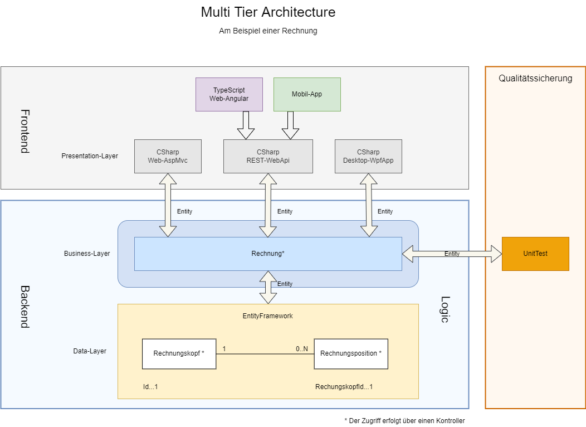

Multi Tier Architecture  
=======================  
  
Die ***Multi Tier Architecture*** ist ein sehr haeufig angewandtes Strukturmuster fuer die Architektur von Softwaresystemen. Das ***QT12SS*** implementiert ebenfalls diese Struktur. Die Struktur beinhaltet im Wesentlichen die 3 Schichten  
  
- Praesentationsschicht,  
- Geschaeftslogik,  
- und die Datenlogik.  
  
## Datenlogik  
  
Auf der Datenebene werden alle datentechnischen Belangen abgebildet. Dazu gehoeren die Tabellen von Entitaeten, deren Beziehungen und die Eigenschaften der Spalten (mandatory, Groeßen usw.). Im Falle einer Rechnung werden auf der Datenbank zwei Tabellen, ***Rechnungskopf*** und ***Rechnungsposition***, benoetigt. Diese Tabellen sind ueber eine Fremdschluessel Beziehung miteinander verknuepft und bilden somit eine **1:N-Beziehung**. Diese bedeutet, dass einem ***Rechnungskopf*** beliebig viele ***Rechnungspositionen*** zugeordnet sein koennen(beliebig bedeutet 0..n).  
Das **Datensystem** sorgt dafuer, dass die Fremdschluesselbeziehung eingehalten wird, dass erforderliche Werte (Not Null) definiert werden und die Groeßen der Datenwerte nicht ueberschritten werden. Alle **Geschaeftsregeln**, welche auf die Datenebene uebertragen werden koennen, sollen auch auf diesem System abgebildet werden. Dies hat den Vorteil, dass die Daten in letzter Instanz ueberprueft und validiert werden koennen.  
  
## Geschaeftslogik  
  
Im Bereich der Domaenenschicht werden grundsaetzliche alle **Logik-Regeln** umgesetzt, welche von der Datenschicht nicht umgesetzt werden koennen. Dazu gehoert die Regel - in unserem Beispiel der Rechnung, dass nur Rechnungen mit **mindestens** einer **Rechnungsposition** im System vorhanden sein duerfen. Diese **Regel** ist schwierig bis unmoeglich auf der Datenschicht abbildbar und sollte daher in der darueberliegenden Ebene umgesetzt werden. Dies setzt allerdings voraus, dass alle Aktionen ueber den **Business-Layer** erfolgen. Aus diesem Grund muss die Architektur so konzipiert sein, dass der Zugriff auf die beiden Kontroller **Rechnungskopf** und **Rechnungsposition** außerhalb des Projektes ***Invoice.Logic*** geschuetzt sein muss.  
  
## Praesentationsschicht  
  
In der Praesentationsschicht befinden sich in den meisten Faellen viele unterschiedliche Anwendungen welche, auf den Backend zugreifen. Diese koennen vom physikalischen Aufbau sehr unterschiedlich sein. So gibt es Klienten welche ebenfalls in CSharp implementiert worden sind. Dadurch ergibt sich die Moeglichkeit, dass diese Anwendungen direkt auf den Backend zugreifen koennen. Es gibt aber auch Endgeraete die nicht in CShrap implememntiert worden sind oder keine Moeglichkeit des direkten Zugriffs auf das Backend haben (z.B.: Handy). Fuer den indirekten Zugriff auf das Backend gibt es einen REST Service. Dieser erlaubt einen Zugriff ueber das HTTP-Protokoll. Mit diesem Service ergibt sich ein uneingeschraenkter Zugriff auf den Backend.  
  
In der nachfolgenden Abbildung ist die Architektur schematisch dargestellt:   
  
  
  
